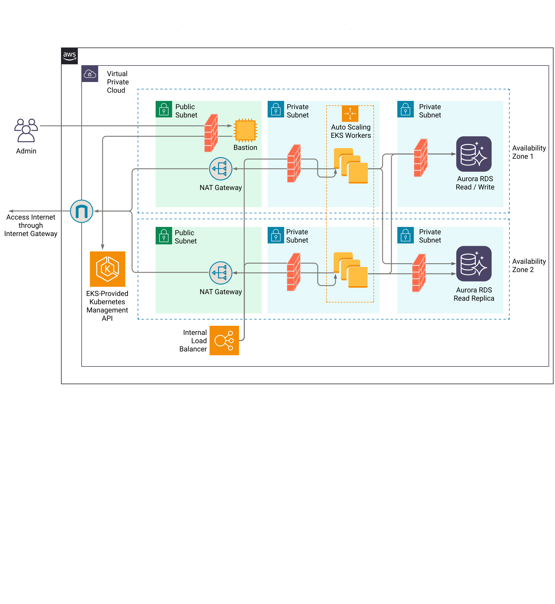

# Astronomer Enterprise

# Required in path and tested versions

[Sample execution environment](pipeline/Dockerfile)

- [Terraform 0.12.3](https://www.terraform.io/upgrade-guides/0-12.html)
- [Helm 2.14.1](https://helm.sh/docs/using_helm/)
- [Kubectl 1.12.3](https://kubernetes.io/docs/tasks/tools/install-kubectl/)
- [aws-iam-authenticator 1.13.7](https://docs.aws.amazon.com/eks/latest/userguide/install-aws-iam-authenticator.html)

# Sample use

[Example module block](examples/from_scratch/main.tf)

The above example creates all resources including VPC and subnets.

# Note

If using private mangement API, you must have some way to access the API. There are a few ways to do this. You can execute from a host inside the VPC you intend to deploy EKS in. You can use --target on module.aws, then start a proxy through the bastion before applying the rest of the module. It may be easiest to just deploy with the management API public, then manually switch it to private in the AWS console.

# Architecture

- optional bastion
- optional VPC and subnet creation
- optional private management API

